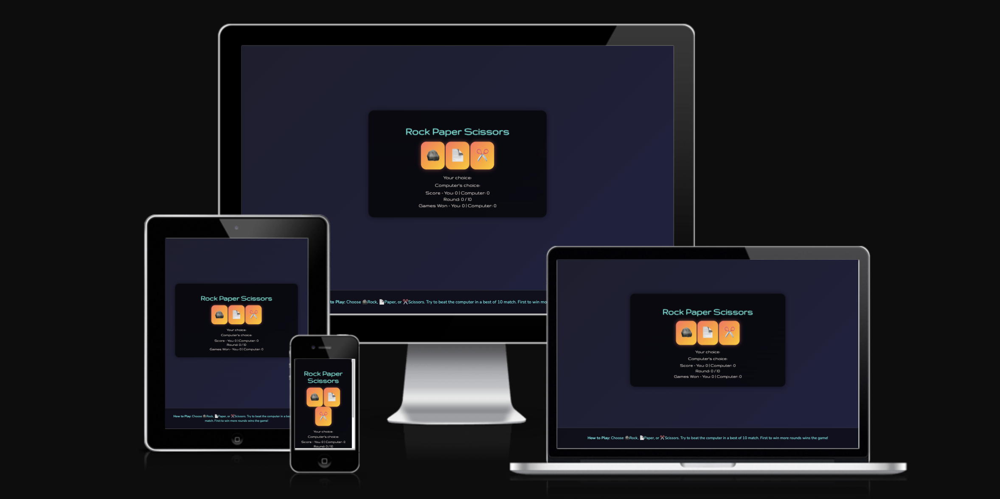
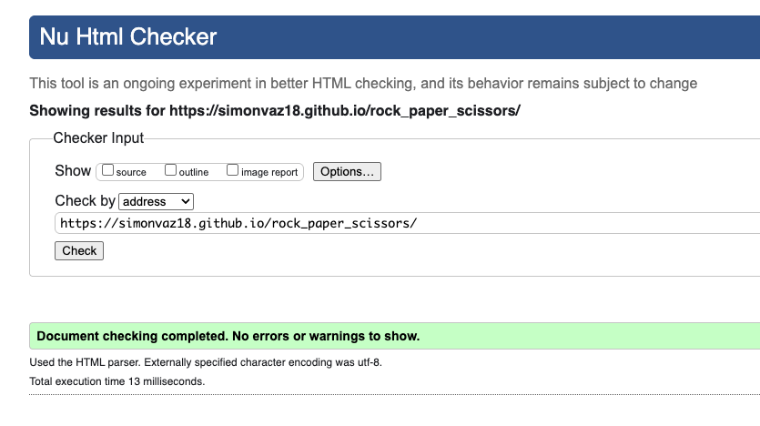
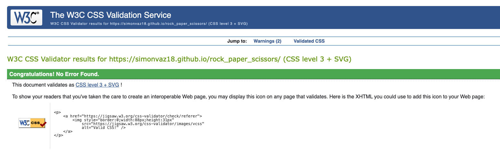
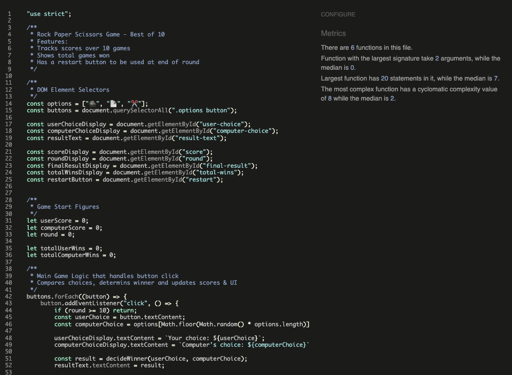

# 🪨📄✂️ Rock Paper Scissors
Project 2 - Simon Vaz

View live github project +++++++++++++++++++++++++

---

## Table of Contents

- Overview
- User Goals
- Features
- Technologies Used
- Testing
- Bugs
- Future Improvements
- Deployment
- Credits

---

## Overview

Rock Paper Scissors is a fun and interactive browser-based implementation of the classic Rock, Paper, Scissors game built using HTML, CSS and JavaScript. The user plays against the computer in a best-of-10 format. The game keeps track of overall victories over multiple rounds. It runs entirely on the front-end and allows the user 10 rounds per match.

The design is intended to be playful and colourful, using emjois as game tokens and featuring glowing animations to enhance the user engagement. 

---

## User Goals 

- Play a full game of Rock, Paper, Scissors in a "best out of 10" format.
- Compete against a randomly-generated computer opponent.
- See a clearly styled result after each round
- Track the score and round progression visually.
- View cumulative wins/losses over multiple games. 
- Easily restart the match without refreshing the browser.

---

## Features 

### 1. Game Interface

- **Emoji Buttons**  
  Players choose from 🪨 (rock), 📄 (paper), or ✂️ (scissors) using clickable emoji buttons.

- **Choice Display**  
  Shows both the player's and computer's choices after each round.

- **Responsiveness**  
  Layout adjusts well to different screen sizes, ensuring a smooth user experience.

### 2. Game Flow 

- **Single Round Execution**  
  Clicking a button triggers one round of the game.

- **Computer Logic**  
  The computer randomly selects one of the three options.

- **Round Limiter**  
  After 10 rounds, the game ends automatically, and input is disabled until reset.

### 3. Score Tracking

- **Round-Based Scoring**  
    - Both user and computer scores update in real-time.
    - Score is displayed as: Score - You: X | Computer: Y.

- **Round Counter**  
  Displays the current round as: Round X / 10.

### 4. Result Display and Animation 

- **Immediate Feedback**
  Result text appears after each round:
  - "You win!"
  - "You lose!"
  - "It's a tie!"

- **Color Coding**
  - 💚 Win: Light Green
  - 🔴 Loss: Red
  - 🟡 Tie: Yellow

- **Glowing Animation**  
  The result message gently pulses for added visual feedback.

### 5. Game Restart

- ** Restart Button**
  - Appears only after a full 10-round game.
  - Resets the current round count and scores.
  - Keeps the overall win/loss tally intact.

### 6. Persistant Totals

- **Cumulative Game Wins**
  - Tracks how many full matches (best of 10) the player and the computer have won.
  - Displayed as: Games Won - You: X | Computer: Y
  - Designed to encourage replay and competition.

### 7. Footer

  - The footer section describes the rules of the game and how to play.
  - The styling of the footer is in keeping with the rest of the webpage.

---

## Technologies Used

- **HTML5** – Provides the structure and content of the game interface.
- **CSS3** – Handles layout, styling, animations, and color effects.
- **JavaScript (ES6+)** – Powers the core game logic, scorekeeping, and user interactions.

---

## Testing

The site has been tested across multiple browsers including Chrome, Safari and Edge to ensure cross-browser compatibility. Additionally, it was also tested on various screen sizes to ensure all funtionality is fully responsive. 

### Manual Testing

| **Test No.** | **Test Scenario**                                  | **Test Steps**                                           | **Expected Result**                                                         | **Pass/Fail**                 |   |
| ------------ | -------------------------------------------------- | -------------------------------------------------------- | --------------------------------------------------------------------------- | ----------------------------- | - |
| 1            | Game starts with correct UI                    | Open game in browser                                     | Score: 0–0, Round: 0 / 10, Restart button hidden, result empty              | ✅                             |   |
| 2            | Player selects an emoji                            | Click on 🪨, 📄, or ✂️ button                            | Player and computer choices display, result shows outcome, score updates    | ✅                             |   |
| 3            | Computer randomly selects option                   | Play several rounds                                      | Computer choice varies randomly                                             | ✅                             |   |
| 4            | Score updates  after win                          | Select option that beats the computer's (e.g., 📄 vs 🪨) | "You win!" message, user score increases by 1                               | ✅                             |   |
| 5            | Score updates  after loss                      | Select option that loses to computer's (e.g., ✂️ vs 🪨)  | "You lose!" message, computer score increases by 1                          | ✅                             |   |
| 6            | Score updates after tie                          | Select same option as computer (e.g., 📄 vs 📄)          | "It's a tie!" message, no score change                                      | ✅                             |   |
| 7            | Round counter updates                          | Play one round                                           | Round counter increments (e.g., Round 1 / 10)                               | ✅                             |   |
| 8            | Game ends after 10 rounds                          | Play 10 rounds                                           | Input disabled (clicks ignored), final result shown, restart button appears | ✅                             |   |
| 9            | Restart button resets match but keeps total scores | Click restart button after 10 rounds                     | Round and current scores reset to 0, total wins remain unchanged            | ✅                             |   |
| 10           | UI is responsive on different screen sizes         | Resize browser window or view on mobile                  | Layout adjusts (no broken UI, all elements accessible)                      | ✅                             |   |
| 11           | No input accepted after round 10                   | Click any emoji after round 10 is complete               | No change in display or score                                               | ✅                             |   |

 

## Code Validation

### HTML Validation

 ### CSS Validation

 

 ### JavaScript Validation

 

 ### Bugs

 - During testing, I found that once 10 rounds had been played with the game finished and a winner decided, if the user continued to choose an option the round number would continue to increase e.g. Round 12/10. To mitigate this, I added a guard clause that protects the game logic from running once 10 rounds have already been played.
 - When executing the lighthouse testing, the SEO score was 90 due to no Meta description being present. Once I added a Meta the score increased to 100.
 - The 'Play Again' button had a brown background with white text. Upon review, these colours were not particularly enticing for the user to continue playing. As a result, I changed the colours to a shade of green with black text. 

 ### Unfixed Bugs

 - No unfixed bugs. 

 ### Improvements

 - **Sound Effects** - Add fun sounds when chosing moves and seeing results.
 - **Imrpove compuer logic** - Introduce smarter strategy to the computer opponent.
 -- **Theme Options** - Allow users to choose different themes relating to UI.
 - **Local Storage** - Persist total wins/losses even after refreshing or reopening the browser.

## Lighthouse Testing

### Lighthouse Test Desktop

### Lighthouse Test Mobile

---

## Deployment 
This site was deployed to Github pages. The steps to deploy are as follows:
- Once code was ready to be pushed to Github, I used the commandsv 'Git add', 'Git commit -m "-"', 'Git push'
- In the Github repository, navigate to the Settings tab
- Select the pages window and the source section drop-down menu, select the Master Branch
- Now the page will automatically be refreshed and shown

---

## Credits 

Throughout the site build I used the following sources:
- [W3Schools.com](https://www.w3schools.com/)
- https://getemoji.com/
- References from the Code Instutute Love Maths Project